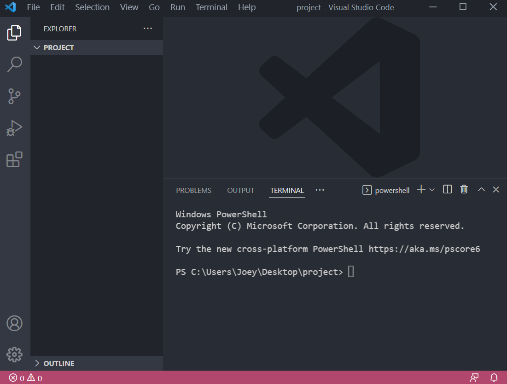
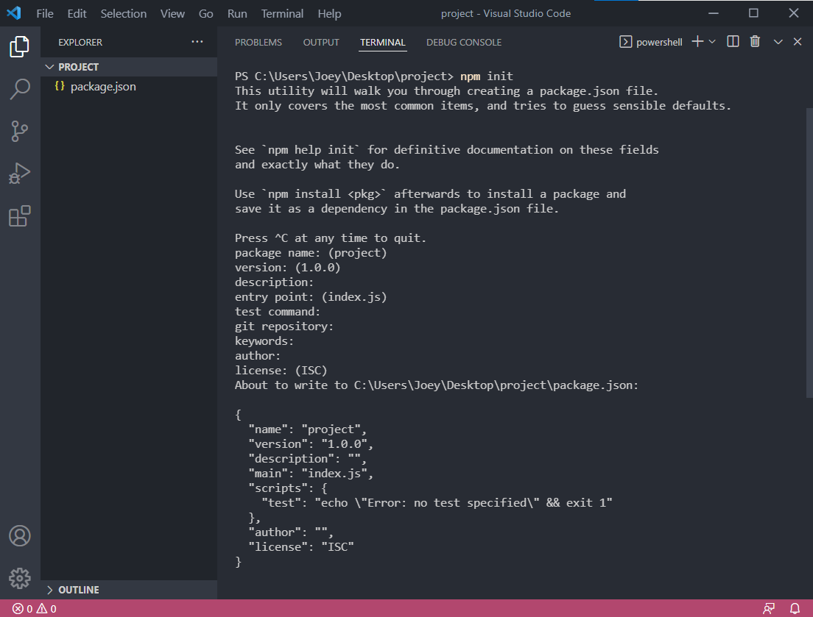
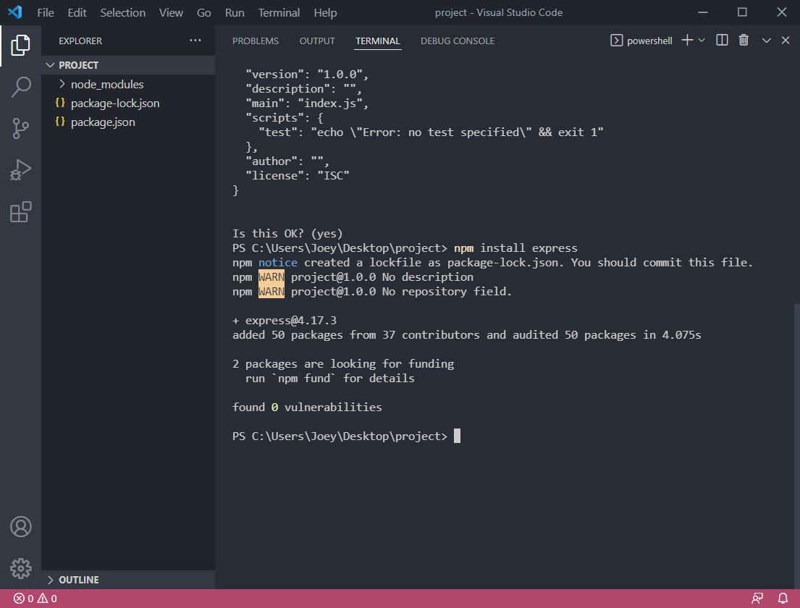
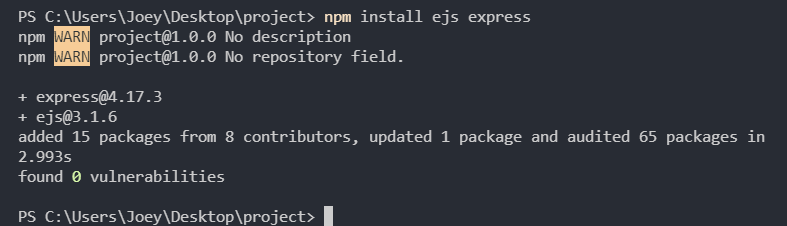
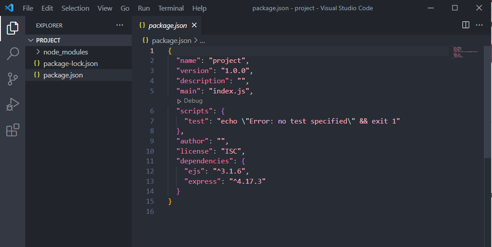

# Installing Express.js
This step will walk you through the process of installing the express.js library for your project.

### Step 1: Open the Visual Studio Code software

### Step 2: Create a designated folder to store your project files

### Step 3 (macOS): Drag your folder into the Workspace column on the left of the VS Code interface
You will be greeted with a pop up. Select 'Yes, I trust the authors'.

### Step 3 (Windows): Go under the 'File' tab on the navigation bar and select 'Open folder'. Select your designated folder.
You will be greeted with a pop up. Select 'Yes, I trust the authors'.

### Step 4: Hit **[CTRL]** and **[~]** simultaneously on your keyboard to open the terminal.
The terminal should open up at the bottom of the application.

💭 **NOTE** : Make sure that the directory in the terminal matches the directory of your project folder.

### Step 5: Type `npm init` in the terminal and hit **[Enter]** to run the command
You will see some prompts appear in the terminal. Hit **[Enter]** for each prompt. Once you see the prompt *`Is this OK? (yes)`*, hit **[Enter]** once more. You should see a new file listed in your project directory in the Workspace column called *package.json*.

### Step 6: Type `npm install express` in the terminal and hit **[Enter]** to run the command
You can watch the installation process in the terminal. The installation has succeeded when you see the prompt *`found 0 vulnerabilities`*. You may see some WARNING prompts. Do not worry about these.

### Step 7: Type `npm install ejs express` in the terminal and hit **[Enter]** to run the command
You can watch the installation process in the terminal. The installation has succeeded when you see the prompt *`found 0 vulnerabilities`*. You may see some WARNING prompts. Do not worry about these.

### Step 8: Confirm that the installations have succeeded by checking the *package.json* file
`express.js` and `ejs` should now be listed under `dependencies`.

❗ **CAUTION** : Do not delete or alter the package.json file!

#### Congratulations! You have completed Step 1. 🚀
