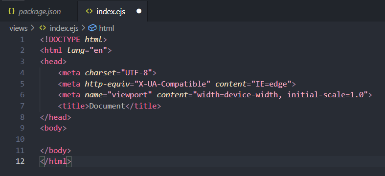
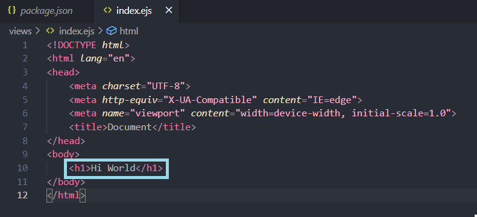
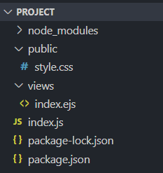

# Building File Structure
### Overview
(intro here)
Now that you have successfully installed Express.js and EJS, let's set up your project directory. In this step, you will create the folders and files in which you will build your project upon.

In this task, we will be making the following files and directories:
> - *index.js* file: acts as the central logic file that handles the server hosting logic.
> - *views* folder: contain all the Embedded Javascript Templates(ejs) files. EJS files are **dynamic** HTML files that can handle JavaScript logic.
>> - *index.ejs* file: A ejs file that uses logic from the *index.js* file to serve content.
> - *public* folder: Holds all static files of the application such as CSS files and image assets.
>> - *style.css* file: Contains styling that can be linked to EJS or HTML files.

💭 NOTE: In order to create files and folders using VSCode, hover your cursor over the project directory and select the appropriate icon.

---

### Express.js File Structure

**1.** Create a new file named *index.js* in your project folder.
💭 NOTE: Make sure you the file is located in your project folder as shown below.


```
project/
  |-- node_modules/
  |-- package.json
  |-- package-lock.json
  |-- index.js
```


❗ CAUTION: For the purpose of this project, this file that you are creating in this step MUST be named index.js. Node.js will by default look for a file with this specific name.


**2.** Create a new folder named *views* in your project folder.
💭 NOTE: Make sure you the file is located in your project folder as shown below.


```
project/
  |-- node_modules/
  |-- package.json
  |-- package-lock.json
  |-- index.js
  |-- views/
```


❗ CAUTION: For the purpose of this project, this folder that you are creating in this step MUST be named views. Node.js will by default look for a folder with this specific name.


**3.** Create a new file named *index.ejs* in your *views* folder.
💭 NOTE: Make sure you the file is located in your project folder as shown below.


```
project/
  |-- node_modules/
  |-- package.json
  |-- package-lock.json
  |-- index.js
  |-- views/
    |-- index.ejs
```

❗ CAUTION: For the purpose of this project, this file that you are creating in this step MUST be named index.ejs. Node.js will by default look for a file with this specific name.


**4.** Add boilerplate html code in the *index.ejs* file by typing `!` in the editor and then hitting **[Enter]**.
Once you've hit enter, VS Code will automatically generate starting HTML code.





💭 NOTE: Remember to save your file after making changes by hitting **[CTRL]** and **[S]** simulatenously.


**5.** Locate the `<body>` tag in the boilerplate and then add any basic html between the `<body>` and `</body>` tag.
In this case, we added a heading that reads "Hi World".





**6.** Create a new folder named *public* in your project folder.
💭 NOTE: Make sure you the file is located in your project folder as shown below.


```
project/
  |-- node_modules/
  |-- package.json
  |-- package-lock.json
  |-- index.js
  |-- views/
    |-- index.ejs
  |-- public/
```

❗ CAUTION: For the purpose of this project, this folder that you are creating in this step MUST be named public. Node.js will by default look for a file with this specific name.


**7.** Create a file named *style.css* in the public folder.
💭 NOTE: The css file can have any name, but style.css is the standard convention.

```
project/
  |-- node_modules/
  |-- package.json
  |-- package-lock.json
  |-- index.js
  |-- views/
    |-- index.ejs
  |-- public/
    |-- style.css
```

### Conclusion

##### These are all the folders and files that should now exist in your project directory: 





❗ CAUTION: Make sure that all of the folders and files have been made and are correctly located before moving on. Errors in this task will block any further progress.


### Yay! You may now move on to [Requiring Express.js](step-3.md). 😃
