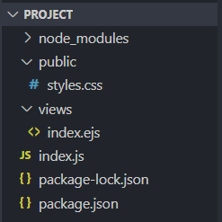

# Building File Structure
Now that you have successfully installed Express.js and EJS, let's set up your project directory. In this step, you will create the folders and files in which you will build your project upon.

In this task, we will be making the following files and directories:
- *index.js file*
- *views folder*
- *index.ejs file*
- *public folder*
- *style.css file*.

The *index.js* acts like the central logic file that handles the server hosting logic.

The *views* directory will contain all the EJS files. EJS files are HTML files that can handle JavaScript logic. In this task, we will be making an *index.ejs* file.

We will also be making a *style.css* file which will live in a folder named *public*.

## Step 1: Create a new file named *index.js* in your project folder by clicking on your project folder then clicking the file icon in the 'Workbench' column
💭 NOTE: Make sure you the file is located in your project folder as shown in the screenshot below.

❗ CAUTION: For the purpose of this project, this file that you are creating in this step MUST be named index.js. Node.js will by default look for a file with this specific name.

## Step 2: Create a new folder named *views* in your project folder by clicking on your project folder then clicking the folder icon in the 'Workbench' column
💭 NOTE: Make sure you the file is located in your project folder as shown in the screenshot below.

❗ CAUTION: For the purpose of this project, this folder that you are creating in this step MUST be named views. Node.js will by default look for a folder with this specific name.

## Step 3: Create a new file named *index.ejs* in your *views* folder by clicking on your *views* folder then clicking the file icon in the 'Workbench' column
💭 NOTE: Make sure you the file is located in your project folder as shown in the screenshot below.

❗ CAUTION: For the purpose of this project, this file that you are creating in this step MUST be named index.ejs. Node.js will by default look for a file with this specific name.

## Step 4: Add boilerplate html code in the *index.ejs* file by typing `!` in the editor and then hitting **[Enter]**.
Once you've hit enter, VS Code will automatically generate starting HTML code.

💭 NOTE: Remember to save your file after making changes by hitting **[CTRL]** and **[S]** simulatenously.

## Step 5: Locate the `<body>` tag in the boilerplate and then add any basic html between the `<body>` and `</body>` tag.
In this case, we added a heading that reads Hi World.

## Step 6: Create a new folder named *public* in your project folder by clicking on your project folder then clicking the folder icon in the 'Workbench' column
💭 NOTE: Make sure you the file is located in your project folder as shown in the screenshot below.

❗ CAUTION: For the purpose of this project, this folder that you are creating in this step MUST be named public. Node.js will by default look for a file with this specific name.

## Step 7: Create a file named *style.css* in the public folder by clicking on your *public* folder and then clicking the file icon in the Workbench column
💭 NOTE: The css file can have any name, but style.css is the standard convention.

### Here is a screenshot of all the folders and files that should now exist in your project directory. 
❗ CAUTION: Make sure that all of the folders and files have been made and are correctly located before moving on. Errors in this task will block any further progress.

### Yay! You may now move onto Task 3. 😃
