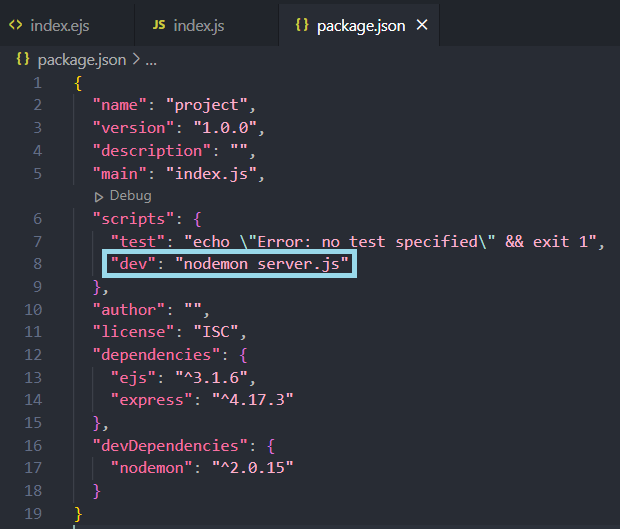

# Requiring Express.js
### Overview
(intro here)
*Express.js* is a library that we have installed in Task 1. In order to utilize it in our code, we need to require it.
Task 3 is a walkthrough on how to require *Express.js*. 

We will also be installing a library called *nodemon* which will
automatically restart the localhost server everytime you save a file. This eliminates the need to manually restart the
server to see changes.

---

### Requiring Express.js, installing nodemon, and sending Hello World

**1.** Open the *index.js* file and copy and paste the following code into the editor.
```
const express = require('express')
const app = express()
const port = 3000

app.set('view engine', 'ejs')


app.get('/', (req, res) => {
  res.send('Hello World!')
})

app.listen(port, () => {
  console.log(`Now listening on port ${port}`)
})
```

**2.** Run the command `npm i -D nodemon` in the terminal to install the nodemon library.

Just like in Task 1 when you installed *Express.js* and *EJS*, wait until the installation has completed. 
If the installation was successful, the prompt `*found 0 vulnerabilities*` will be printed on the terminal.


💭 NOTE: You can confirm the installation of *nodemon* in the *package.json* file. `nodemon` should be listed under
a heading called `devDependencies`.

**3.** Open the *package.json* file. Under `scripts`, add a comma after `"test": "echo \"Error: no test specified\" && exit 1"` then add `"dev": "nodemon server.js"` under it
❗ WARNING: Do not change anything else in the *package.json* file.





💭 NOTE: Remember to save the file after making changes.

**4.** Run the command `npm run dev` in the terminal to start the server
💭 NOTE: Once you have run the command `npm run dev`, the server will automatically refresh with each save, which means
that you do not need to run the command while the server is active. To end the server session, press **[CTRL]** and **[C]** simultaneously
while in the terminal.


Test that *nodemon* works by saving the file. You should see messages in the terminal of the server restarting.

**5.** Reload the localhost:3000 page on your browser to check your changes
You should be able to see Hello World.


#### 🥳 Amazing! You used Express.js to send text to a page! Now you can move on to [Basic Routing Methods](step-4.md). 

