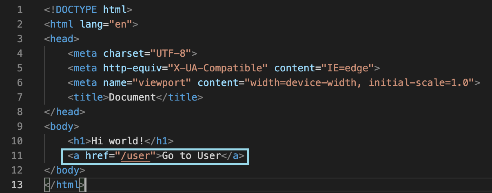

# Basic Routing Methods
### Overview
*Routing* is an essential part of back-end development and it determines how the application responds to client requests to a *URI(path)* and a specific *HTTP request method*. Express simplifies this process by easily controlling what *callback function* gets invoked when a user navigates to a particular URL. The application then listens for requests that match a specific route and executes the associated code.

Routes in Express are defined using *methods* of the Express app object which correspond to HTTP methods such as GET and POST requests. The *function signature* is as follows:

>`app.METHOD(PATH, HANDLER)`
> - `app`: is an instance of Express
> - `METHOD`: is the Express route method(eg. `get`, `post`)
> - `PATH`: is a path on the server
> - `HANDLER`: is the callback function that executes when the METHOD and PATH matches the client HTTP request

---

### Routing GET Requests

**1.**  In *index.js*, in the home route(“/”), change `res.send('Hello World!')` to `res.render(‘index’)`. The edited code should look like this:


**2.**  In order to use ejs files, install the **Embedded Javascript Templates(ejs)** module with the command:

```
npm install ejs
```

**3.**  Save the files and refresh the browser. The index.ejs file contents should show up and look like this. Yay!


💭 **NOTE**: Please remember to save in VScode before refreshing the browser. If the page is still not loading, see the [troubleshooting](troubleshooting.md) for possible solutions.

**4.**  Make a new file in 'views' folder called *user.ejs*. Copy and paste this code into the file, this is **boilerplate** HTML code with a heading to identify it as the user page:
```
<!DOCTYPE html>
<html lang="en">
<head>
   <meta charset="UTF-8">
   <meta http-equiv="X-UA-Compatible" content="IE=edge">
   <meta name="viewport" content="width=device-width, initial-scale=1.0">
   <title>Document</title>
</head>
<body>
   <h1>This is the user page</h1>
</body>
</html>
```

The file and folder structure should now look like this:


**5.**  Next we have to connect the user page to the homepage. Add the link `<a href="/user">Go to User</a>` in the *index.ejs* file under the “hi world” heading. The code should now look like this:


**6.**  Now we have to connect "Go to user" to an Express method that handles the request when the link is clicked. In *index.js*, copy and paste this new route that renders the user.ejs page at the /user url:
```
app.get('/user', (req, res) => {
   res.render('user')
})
```

**7.**  Save and refresh the browser to see changes. There should now be a link on the homepage that when clicked, directs to the user page. The homepage should look like this:


This /user page should look like this:


### Conclusion
Congratulations! You successfully created a route to the user page. There are other routes such as `PUT` and `DELETE` that serve different functions not covered in this guide. If you would like to explore more routes options, please see the complete routing guide provided in the [Express Router Documentation](https://expressjs.com/en/guide/routing.html).

Continue on to learn how to use [Middleware for Static Files](step-5.md).


