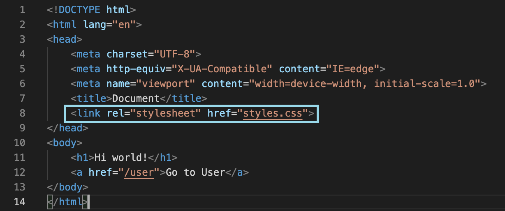

# Middleware for Static Files
### Overview
Middleware is anything placed between layers of one software to another. Middleware in Express are functions that can access the request object(req) and response object(res) for each route so are about to execute any code and make changes to those objects. They also have access to the next function in the applications request-response cycle, therefore, middleware can end the cycle or call the next middleware function in the queue. 

There are various types that have different uses but this document focuses on middleware to display static files such as CSS and images. The function signature is as follows:
> `express.static(root, [options])`
> `root` the root directory where the static assets are kept
> `options` are optional arguments that determine how certain situations are dealt with

💭 **NOTE**: Please see the [express.static](https://expressjs.com/en/4x/api.html#express.static) documentation for more information about the different of options available.

### Displaying Static Files

**1.** In the 'public' folder, create a *styles.css* file and add some CSS for the *index.ejs* page. Feel free to customize it or copy and paste this code:
```
* {
 background-color: blue;
 color: yellow;
 font-size: 60px;
}
```

💭 **NOTE**: ejs files are treated similarly to HTML so CSS can be used in the same way.

**2.** Link the CSS file to the *index.ejs* file as you would for HTML into the head tag using this code:

```
<link rel="stylesheet" href="styles.css">
```

*index.ejs* should now look like:



**3.** Now, we need to tell Express to use “public” as the static directory that hold static files such as CSS and images. In app.js, please add:
```
 app.use(express.static('public'))
 ```
 
💭 **NOTE**: Express searches for files relative to the static directory which is now “public”. Therefore, the static file name can be used directly when referencing, such as linking the CSS.

**4.** Save and refresh the browser. Changes should execute on the homepage as so:


And you're done! You have completed all the sections of the guide and covered the basics of how to implement Express in a static Node.js application. We hope that this documentation has been helpful and happy developing!


